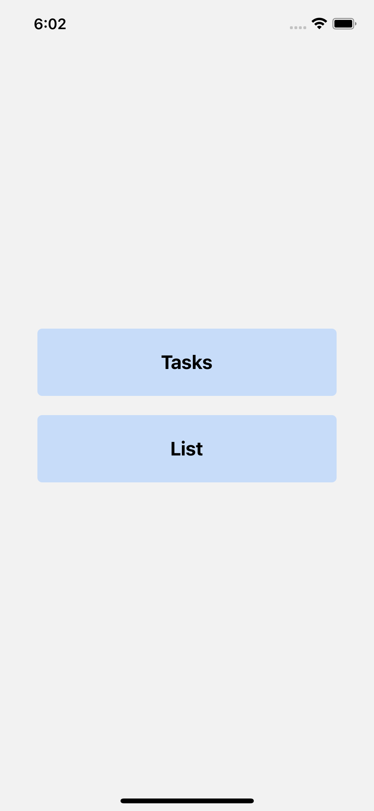
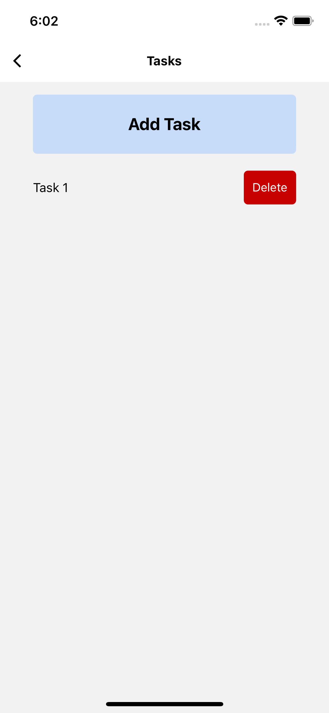
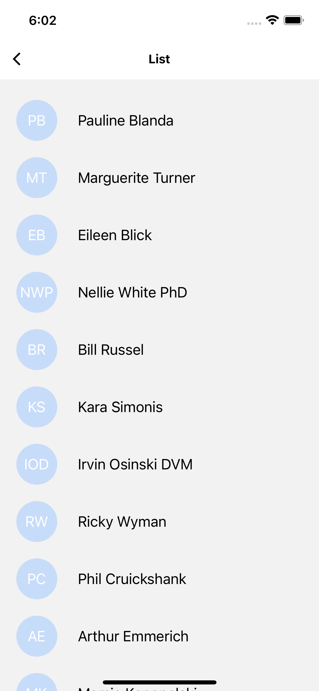
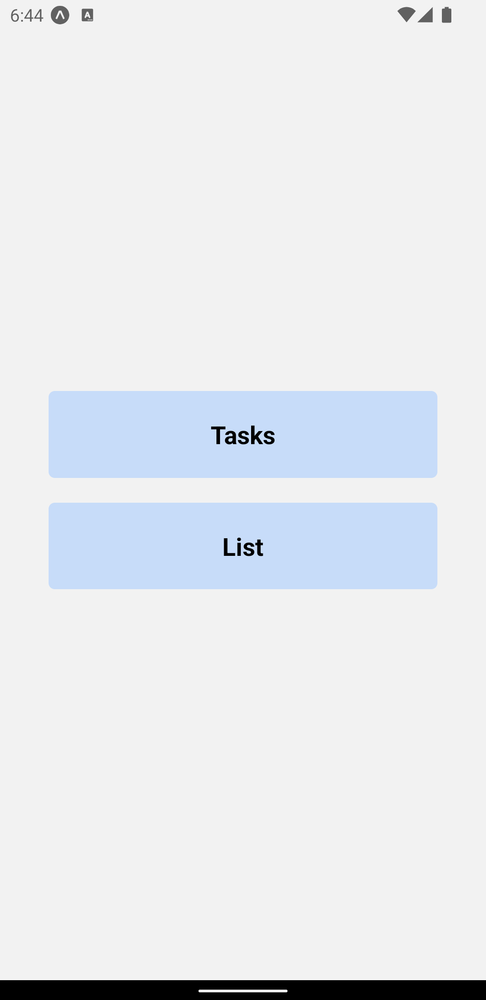
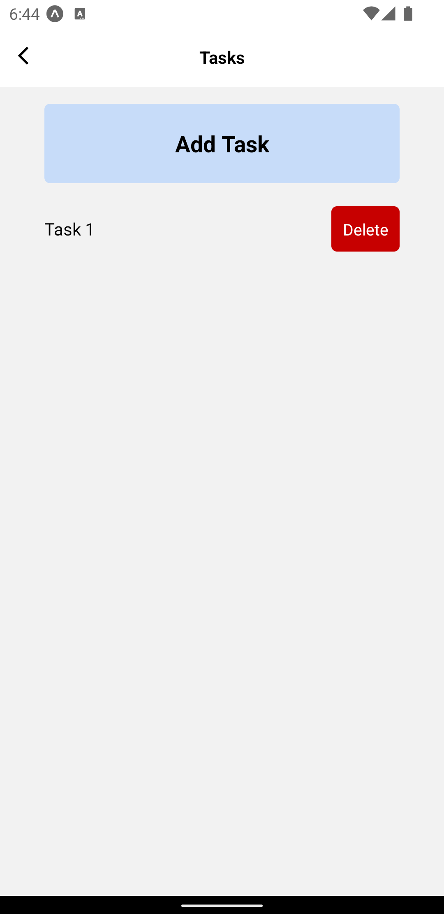
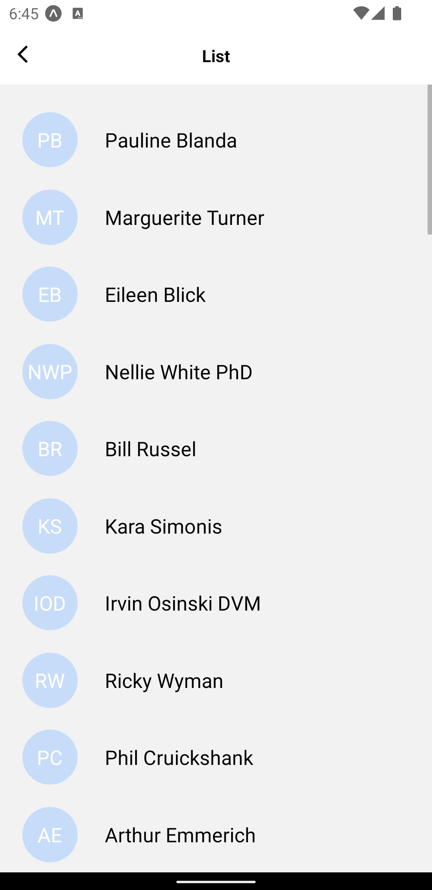

# Tasks App

This is a small app that has two screens:
- Tasks: lets the user add tasks and delete them, displays them in a list.
- List: fetches a list of users/people from an api and displays them in a list with an avatar to the left of each one

## Prerequisites

Before you begin, ensure you meet the following requirements:

- **Node.js**: Download and install Node.js from nodejs.org.

- **Expo CLI**: Install Expo CLI globally on your machine:
  ```
  npm install -g expo-cli
  ```

## Cloning the Repository

To clone the repository, follow these steps:

- **Git**: If not already installed on your machine, download and install Git from git-scm.com.
  ```
  git clone <repo url>
  ```
## Installing dependencies

cd into the cloned repo and run:
  ```
  npm install
  ```

## Running the app

This document assumes you already have your environemtn ready to run iOS and Android apps, if not refer to the environment setup docs on https://reactnative.dev/docs/environment-setup

- When environment is ready inside the project folder run:
  ```
  npx expo start 
  ```

- Press `i` in the terminal where your Expo dev server is running to open the iOS simulator.

- Press `a` in the terminal where your Expo dev server is running to open the Android simulator.

### Running on a physical device:

- Download the Expo Go app from your device's app store (iOS or Android).
- Scan the QR code in your terminal or from the Expo dev tools browser window that opened automatically when you started the project.

## iOS Images




## Android Images



